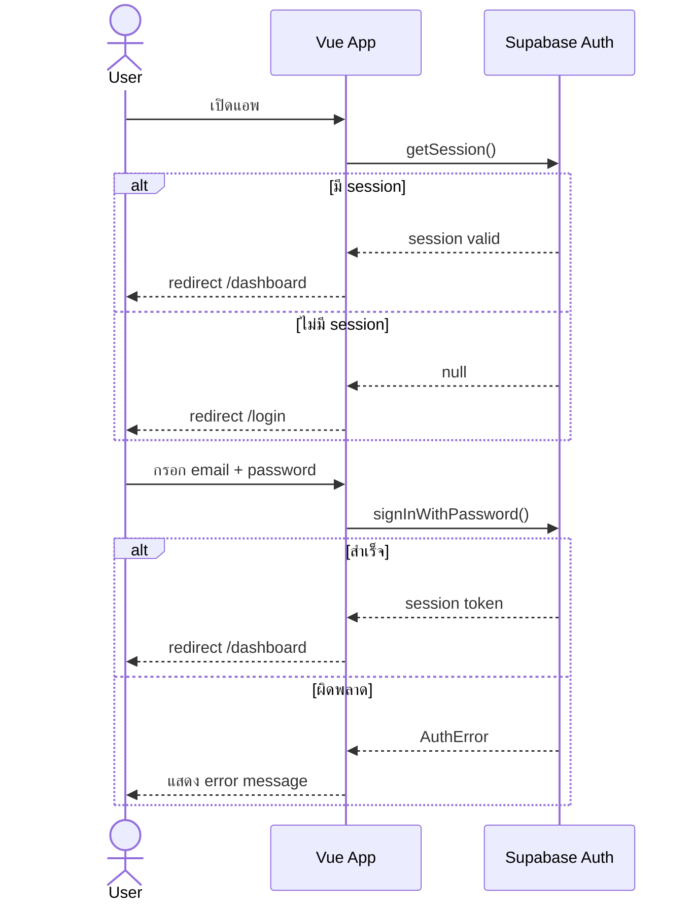
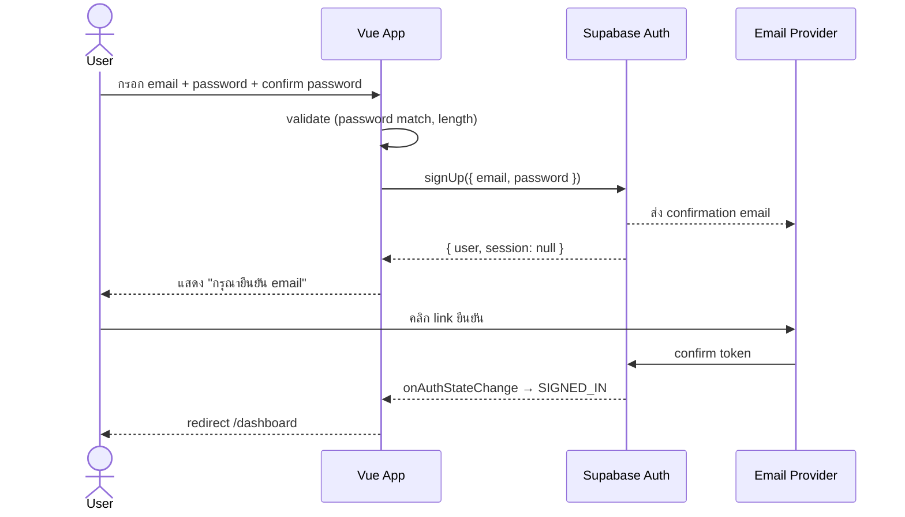
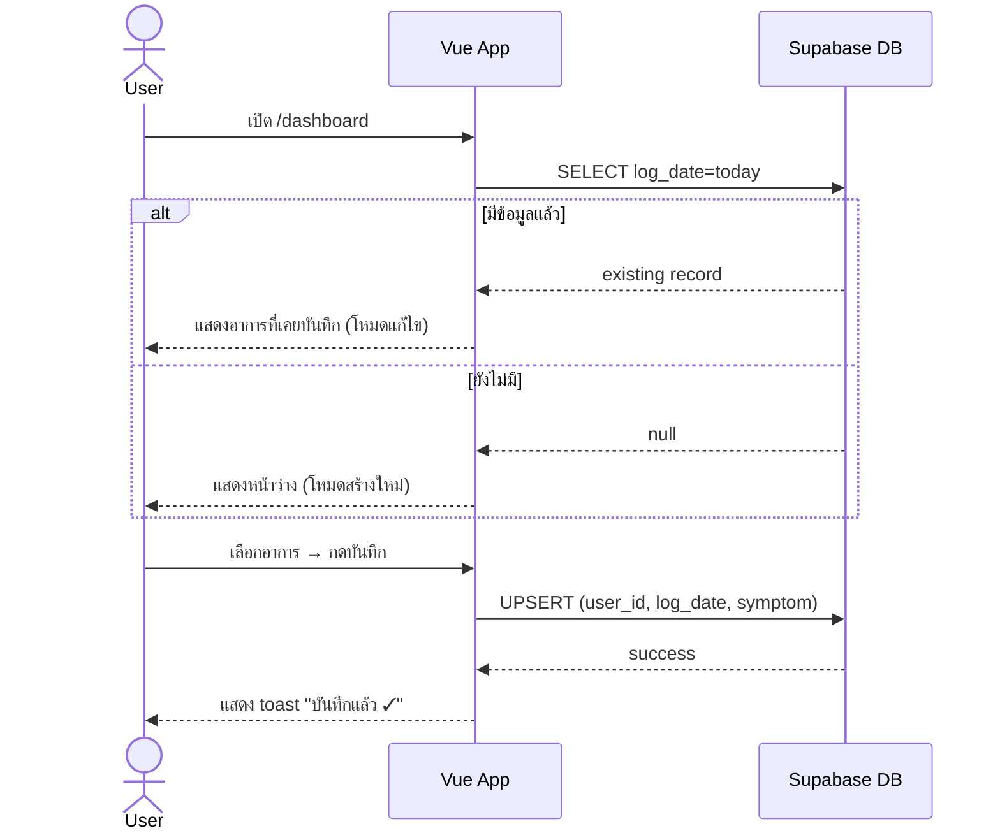
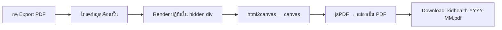

# 📋 Requirements: KidHealth Tracker
> แอพติดตามอาการป่วยรายวันของลูก  
> Stack: Vue 3 · Supabase · Vercel

---

## 1. Overview

แอพพลิเคชันสำหรับผู้ปกครองในการบันทึกอาการป่วยรายวันของลูก แสดงผลสรุปเป็นสีรายเดือนเพื่อให้เห็นแนวโน้มสุขภาพได้ง่าย

---

## 2. Application Flow (Mermaid)

### 2.1 User Journey Overview

```mermaid
flowchart TD
    Start([เปิดแอพ]) --> CheckSession{มี Session?}
    CheckSession -- ใช่ --> Dashboard
    CheckSession -- ไม่มี --> AuthPage{เลือก}

    AuthPage --> Login[login]
    AuthPage --> Register[register]

    Register --> FillRegister[กรอก Email + Password]
    FillRegister --> VerifyEmail[ยืนยัน Email]
    VerifyEmail --> Dashboard

    Login --> FillLogin[กรอก Email + Password]
    FillLogin --> LoginOK{Login สำเร็จ?}
    LoginOK -- ใช่ --> Dashboard[dashboard]
    LoginOK -- ไม่ --> ErrLogin[แสดง Error]
    ErrLogin --> FillLogin

    Dashboard --> SelectDate[เลือกวันที่]
    SelectDate --> SelectSymptom[เลือกอาการ 1 ใน 5]
    SelectSymptom --> Save[กดบันทึก]
    Save --> SaveOK{Upsert สำเร็จ?}
    SaveOK -- ใช่ --> SuccessMsg[แสดงข้อความยืนยัน]
    SaveOK -- ไม่ --> ErrSave[แสดง Error]

    Dashboard --> GoSummary[summary]
    GoSummary --> PickMonth[เลือกเดือน/ปี]
    PickMonth --> ShowCalendar[แสดงปฏิทินสี]
    ShowCalendar --> ExportPDF[กด Export PDF]
    ExportPDF --> DownloadFile[ดาวน์โหลด PDF]

    Dashboard --> Logout[Logout]
    Logout --> Login
```



### 2.2 Auth Flow



### 2.3 Register Flow



### 2.4 Daily Log Flow



### 2.5 Export PDF Flow



---

## 3. Color System (สีแทนอาการ)

| สี | Hex | อาการ | ชื่อรหัส |
|---|---|---|---|
| 🟢 เขียว | `#4CAF50` | ปกติ | `NORMAL` |
| 🔵 ฟ้า | `#2196F3` | มีน้ำมูกใส | `RUNNY_CLEAR` |
| 🟠 ส้ม | `#FF9800` | มีไข้ | `FEVER` |
| 🔴 แดง | `#F44336` | มีไข้ + น้ำมูกใส | `FEVER_RUNNY_CLEAR` |
| 🟤 น้ำตาล | `#795548` | มีไข้ + น้ำมูกเขียว | `FEVER_RUNNY_GREEN` |

---

## 4. Screens

### 4.1 หน้า Register

**Path:** `/register`

**Elements:**
- Input: ชื่อจริง (First Name)
- Input: นามสกุล (Last Name)
- Input: Email
- Input: Password (masked, min 8 ตัว)
- Input: Confirm Password
- ปุ่ม "สมัครสมาชิก"
- Link กลับไปหน้า Login
- หน้าแจ้ง "กรุณายืนยัน email" หลังสมัครสำเร็จ

**Business Rules:**
- ใช้ Supabase Auth `signUp()`
- ส่ง first_name + last_name ไปใน `options.data` (user_metadata) ตอน signUp
- Supabase ส่ง confirmation email อัตโนมัติ (ต้องเปิด "Confirm email" ใน Supabase Dashboard)
- password ต้อง match และยาว ≥ 8 ตัว ก่อน call API
- หลังยืนยัน email แล้ว redirect `/dashboard`
- หลัง login ครั้งแรก ระบบจะสร้าง record ในตาราง `profiles` อัตโนมัติ (ถ้ายังไม่มี) โดยดึง first_name, last_name จาก user_metadata

---

### 4.2 หน้า Login

**Path:** `/login`

**Elements:**
- Logo / ชื่อแอพ
- Input: Email
- Input: Password (masked)
- ปุ่ม "เข้าสู่ระบบ"
- Link ไป `/register`
- ข้อความ Error กรณี credential ผิด

**Business Rules:**
- ใช้ Supabase Auth `signInWithPassword()`
- เมื่อ login สำเร็จ redirect ไป `/dashboard`
- ถ้า session ยังอยู่ให้ข้าม login ไปเลย

---

### 4.3 หน้าบันทึกอาการ (Daily Log)

**Path:** `/dashboard`

**Elements:**
- Header: ชื่อแอพ + ปุ่ม Logout
- วันที่ปัจจุบัน (แก้ไขได้ ไม่เกินวันนี้)
- ปุ่มเลือกอาการ 5 ปุ่ม แสดงเป็นสีตาม Color System
- ปุ่ม "บันทึก"
- ข้อความยืนยันเมื่อบันทึกสำเร็จ
- Link ไปหน้า Summary

**ปุ่มอาการ (แสดงเป็น Card สี):**
```
[ 🟢 ปกติ ]          [ 🔵 น้ำมูกใส ]
[ 🟠 มีไข้ ]         [ 🔴 มีไข้ + น้ำมูกใส ]
          [ 🟤 มีไข้ + น้ำมูกเขียว ]
```

**Business Rules:**
- 1 วัน บันทึกได้ 1 ครั้ง (ถ้ามีข้อมูลแล้วให้โหลดมาแสดงและอนุญาตให้แก้ไขได้)
- วันที่เลือกต้องไม่เกินวันปัจจุบัน
- ต้องเลือกอาการก่อนถึงจะกดบันทึกได้

---

### 4.4 หน้า Summary รายเดือน

**Path:** `/summary`

**Elements:**
- Header: ชื่อแอพ + ปุ่ม Logout
- ตัวเลือกเดือน/ปี (← →)
- ปฏิทิน Grid (7 คอลัมน์ จ–อา)
  - แต่ละช่องวันแสดงเป็น **สีพื้นหลัง** ตาม Color System
  - วันที่ไม่มีข้อมูล = สีเทาอ่อน `#EEEEEE`
  - วันอนาคต = ว่างเปล่า / disabled
- Legend แสดงความหมายสีทั้ง 5
- นับจำนวนวันแต่ละสถานะด้านล่าง Legend
- ปุ่ม **"Export PDF"**
- Link กลับหน้า Dashboard

**Business Rules:**
- โหลดข้อมูลทั้งเดือนครั้งเดียวจาก Supabase
- Export PDF ใช้ `html2canvas` + `jsPDF` render ปฏิทินตรงๆ
- ไฟล์ที่ได้ชื่อ `kidhealth-YYYY-MM.pdf`

---

### 4.5 หน้าโปรไฟล์

**Path:** `/profile`

**Elements:**
- Header: eyebrow "โปรไฟล์" + heading "บัญชีของคุณ"
- Profile card (gradient header):
  - Avatar (👩)
  - ชื่อ-นามสกุล (จาก profiles.first_name + profiles.last_name)
  - Email
- Profile body:
  - แก้ไขชื่อลูก (child_name) → text input
  - แก้ไขวันเกิดลูก (child_birthday) → date input
  - แสดงอายุลูก คำนวณจาก child_birthday อัตโนมัติ (เช่น "อายุ 2 ปี 3 เดือน 5 วัน")
  - แสดงจำนวนวันที่บันทึก (เดือนนี้)
- ปุ่ม "บันทึก" สำหรับ child_name / child_birthday
- ปุ่ม "ออกจากระบบ" (สีแดง)

**Business Rules:**
- โหลด profile จากตาราง `profiles` ตาม `user_id`
- ถ้ายังไม่มี profile → สร้าง record ใหม่จาก user_metadata ตอน signUp
- child_name และ child_birthday สามารถแก้ไขได้ตลอด
- child_birthday → อายุจะอัปเดตอัตโนมัติที่ frontend (คำนวณจากวันที่ปัจจุบัน เทียบกับ child_birthday)
- แสดงอายุเป็น "X ปี Y เดือน Z วัน" หรือ "X ปี Y เดือน" หรือ "X เดือน" (ถ้าอายุ < 2 ปี) หรือ "X วัน" (ถ้าอายุ < 1 เดือน)

---

## 5. Profile Feature — Data Model

### Table: `profiles`

| Column | Type | Description |
|---|---|---|
| `id` | `uuid` (PK) | ใช้ `auth.uid()` เหมือน `user_id` (1:1 กับ auth.users) |
| `first_name` | `text` | ชื่อจริง (จากตอนสมัคร) |
| `last_name` | `text` | นามสกุล (จากตอนสมัคร) |
| `child_name` | `text` | ชื่อลูก (แก้ไขที่หน้า Profile) |
| `child_birthday` | `date` | วันเกิดลูก (แก้ไขที่หน้า Profile, nullable) |
| `created_at` | `timestamptz` | เวลาสร้าง |
| `updated_at` | `timestamptz` | เวลาแก้ไขล่าสุด |

**Constraints:**
- `PRIMARY KEY (id)` — 1 user มี 1 profile เท่านั้น
- `FOREIGN KEY (id) REFERENCES auth.users(id) ON DELETE CASCADE`

### Row Level Security (RLS):

```sql
-- User เห็นและแก้ไขได้เฉพาะ profile ตัวเอง
CREATE POLICY "Users can manage own profile"
  ON profiles
  USING (auth.uid() = id)
  WITH CHECK (auth.uid() = id);
```

### Profile Creation Flow

1. ตอน SignUp: ส่ง `first_name`, `last_name` ใน `options.data` (user_metadata)
2. ตอน Login ครั้งแรก / หน้า Profile mount: ถ้า `profiles` ยังไม่มี record → สร้าง record ใหม่จาก user_metadata
3. ถ้ามี record แล้ว → โหลดมาแสดงและแก้ไขได้

---

## 6. Export PDF

### Library

```bash
npm install jspdf html2canvas
```

### Implementation Pattern

```js
// src/composables/useExportPdf.js
import html2canvas from 'html2canvas'
import jsPDF from 'jspdf'

export function useExportPdf() {
  async function exportCalendar(elementRef, yearMonth) {
    const canvas = await html2canvas(elementRef.value, { scale: 2 })
    const imgData = canvas.toDataURL('image/png')

    const pdf = new jsPDF({ orientation: 'portrait', unit: 'mm', format: 'a4' })
    const pageWidth = pdf.internal.pageSize.getWidth()
    const imgHeight = (canvas.height * pageWidth) / canvas.width

    pdf.addImage(imgData, 'PNG', 0, 10, pageWidth, imgHeight)
    pdf.save(`kidhealth-${yearMonth}.pdf`)
  }

  return { exportCalendar }
}
```

---

## 7. Data Model (Supabase)

### Table: `daily_logs`

| Column | Type | Description |
|---|---|---|
| `id` | `uuid` (PK) | Auto-generated |
| `user_id` | `uuid` (FK → auth.users) | เจ้าของข้อมูล |
| `log_date` | `date` | วันที่บันทึก |
| `symptom` | `text` | รหัสอาการ (NORMAL / FEVER / ...) |
| `created_at` | `timestamptz` | เวลาสร้าง |
| `updated_at` | `timestamptz` | เวลาแก้ไขล่าสุด |

**Constraints:**
- `UNIQUE (user_id, log_date)` — 1 วันต่อ 1 user มีได้ 1 แถว
- `CHECK symptom IN ('NORMAL','RUNNY_CLEAR','FEVER','FEVER_RUNNY_CLEAR','FEVER_RUNNY_GREEN')`

### Table: `profiles`

(ดูรายละเอียดที่ Section 5 ด้านบน)

### Row Level Security (RLS):

```sql
-- User เห็นและแก้ไขได้เฉพาะข้อมูลตัวเอง
CREATE POLICY "Users can manage own logs"
  ON daily_logs
  USING (auth.uid() = user_id)
  WITH CHECK (auth.uid() = user_id);
```

---

## 8. Environment Strategy

### แนวคิดหลัก

ใช้ **Supabase Project แยกกัน 2 project** สำหรับ dev และ prod  
เพราะ Supabase project แต่ละอันมี URL + Key ของตัวเอง และ database แยกขาดจากกัน

```
dev project  → kidhealth-dev.supabase.co   (ทดสอบ, ข้อมูลทดสอบ)
prod project → kidhealth-prod.supabase.co  (ข้อมูลจริง)
```

---

### ไฟล์ env ในโปรเจกต์

```
project-root/
├── .env                  # ค่า default (ไม่ควร commit ถ้ามี secret)
├── .env.development      # ใช้ตอน npm run dev
├── .env.production       # ใช้ตอน npm run build (Vercel ใช้อันนี้)
└── .env.local            # override ส่วนตัว ไม่ commit (gitignore)
```

**.env.development**
```env
VITE_SUPABASE_URL=https://kidhealth-dev.supabase.co
VITE_SUPABASE_ANON_KEY=eyJdev...
VITE_APP_ENV=development
```

**.env.production**
```env
VITE_SUPABASE_URL=https://kidhealth-prod.supabase.co
VITE_SUPABASE_ANON_KEY=eyJprod...
VITE_APP_ENV=production
```

> ⚠️ **ห้าม commit `.env.production`** → ใส่ค่าจริงใน Vercel Dashboard แทน

---

### Vercel Environment Variables

ตั้งค่าใน Vercel Dashboard → Project → Settings → Environment Variables

| Variable | Environment | Value |
|---|---|---|
| `VITE_SUPABASE_URL` | Production | `https://kidhealth-prod.supabase.co` |
| `VITE_SUPABASE_ANON_KEY` | Production | `eyJprod...` |
| `VITE_SUPABASE_URL` | Preview | `https://kidhealth-dev.supabase.co` |
| `VITE_SUPABASE_ANON_KEY` | Preview | `eyJdev...` |
| `VITE_SUPABASE_URL` | Development | `https://kidhealth-dev.supabase.co` |
| `VITE_SUPABASE_ANON_KEY` | Development | `eyJdev...` |

> Vercel มี 3 environment: **Production** (main branch), **Preview** (PR branch), **Development** (local pull via `vercel env pull`)

---

### .gitignore

```
.env.local
.env.production   # ถ้าใส่ค่า secret จริงไว้
```

---

### สรุป: ใช้ env ไฟล์ไหนเมื่อไหร่

| สถานการณ์ | ไฟล์ที่ Vite ใช้ | ชี้ไป Supabase |
|---|---|---|
| `npm run dev` | `.env.development` | dev project |
| `npm run build` (local) | `.env.production` | prod project |
| Vercel deploy (main) | Vercel Env: Production | prod project |
| Vercel deploy (PR) | Vercel Env: Preview | dev project |
| `vercel env pull` | `.env.local` (auto-generated) | ตาม Vercel setting |

---

## 9. Tech Stack

| Layer | Technology |
|---|---|
| Frontend | Vue 3 (Composition API) + Vite |
| UI | Tailwind CSS หรือ PrimeVue |
| State | Pinia |
| Backend / Auth / DB | Supabase (Auth + PostgreSQL) |
| Hosting | Vercel |
| Router | Vue Router 4 |
| PDF Export | jsPDF + html2canvas |

---

## 10. Project Structure

```
src/
├── assets/
├── components/
│   ├── SymptomCard.vue        # ปุ่มเลือกอาการ (รับ color + label)
│   ├── CalendarGrid.vue       # ปฏิทิน summary (ref สำหรับ export)
│   └── MonthPicker.vue        # ตัวเลื่อนเดือน
├── composables/
│   └── useExportPdf.js        # html2canvas + jsPDF
├── pages/
│   ├── LoginPage.vue
│   ├── RegisterPage.vue
│   ├── DashboardPage.vue
│   ├── SummaryPage.vue
│   └── ProfilePage.vue        # โปรไฟล์ + แก้ไขชื่อ/วันเกิดลูก
├── stores/
│   ├── auth.js                # Pinia: session
│   ├── logs.js                # Pinia: daily logs
│   └── profile.js             # Pinia: profile (first_name, last_name, child_name, child_birthday)
├── lib/
│   └── supabase.js            # Supabase client
├── router/
│   └── index.js               # Vue Router + auth guard
└── constants/
    └── symptoms.js            # Color map + label
```

---

## 11. Routes & Auth Guard

| Path | Component | Auth Required |
|---|---|---|
| `/login` | LoginPage | ❌ |
| `/register` | RegisterPage | ❌ |
| `/dashboard` | DashboardPage | ✅ |
| `/summary` | SummaryPage | ✅ |
| `/profile` | ProfilePage | ✅ |

Auth guard: ถ้าไม่มี session → redirect `/login`  
ถ้ามี session แล้วเข้า `/login` หรือ `/register` → redirect `/dashboard`

---

## 12. Constants: Symptom Map

```js
// src/constants/symptoms.js
export const SYMPTOMS = [
  { code: 'NORMAL',            label: 'ปกติ',                color: '#4CAF50' },
  { code: 'RUNNY_CLEAR',       label: 'น้ำมูกใส',            color: '#2196F3' },
  { code: 'FEVER',             label: 'มีไข้',               color: '#FF9800' },
  { code: 'FEVER_RUNNY_CLEAR', label: 'มีไข้ + น้ำมูกใส',   color: '#F44336' },
  { code: 'FEVER_RUNNY_GREEN', label: 'มีไข้ + น้ำมูกเขียว', color: '#795548' },
]
```

---

## 13. Out of Scope (v1)

- ❌ รองรับหลายโปรไฟล์เด็ก
- ❌ Push notification
- ❌ Export CSV
- ❌ Dark mode
- ❌ Forgot password (ทำได้ผ่าน Supabase default แต่ไม่ได้ design หน้า UI)
