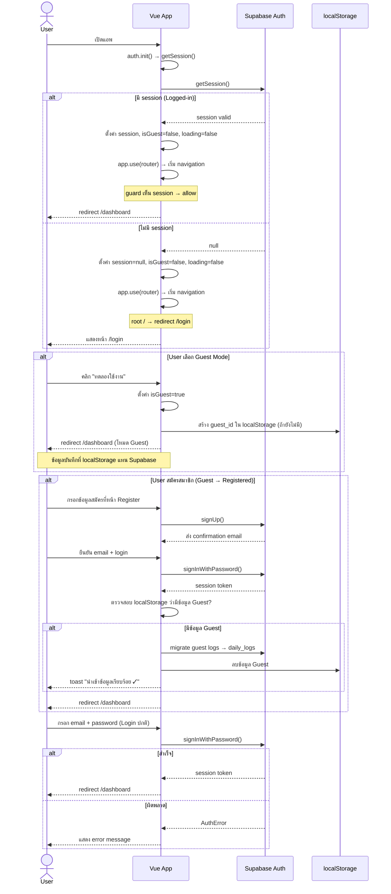
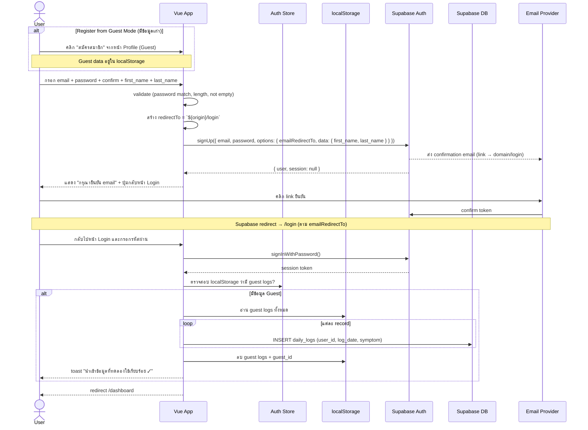
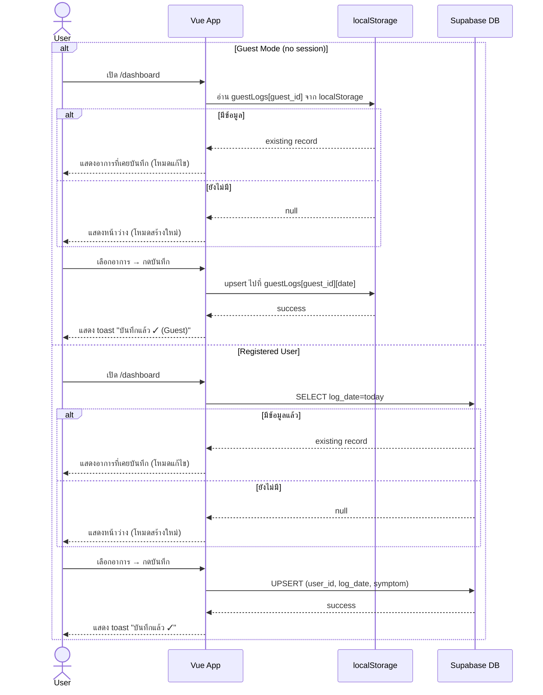
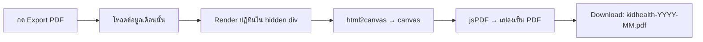

# 📋 Requirements: KidHealth Tracker
> แอพติดตามอาการป่วยรายวันของลูก  
> Stack: Vue 3 · Supabase · Vercel

---

## 1. Overview

แอพพลิเคชันสำหรับผู้ปกครองในการบันทึกอาการป่วยรายวันของลูก แสดงผลสรุปเป็นสีรายเดือนเพื่อให้เห็นแนวโน้มสุขภาพได้ง่าย

---

## 2. Application Flow (Mermaid)

### 2.1 User Journey Overview

```mermaid
flowchart TD
    Start([เปิดแอพ]) --> CheckSession{มี Session?}
    CheckSession -- ใช่ --> Dashboard
    CheckSession -- ไม่มี --> AuthPage{เลือก}

    AuthPage --> Login[เข้าสู่ระบบ]
    AuthPage --> Register[สมัครสมาชิก]
    AuthPage --> GuestMode[ทดลองใช้งาน<br/>Guest Mode]

    GuestMode --> GuestDashboard[Dashboard<br/>แบบ Guest]
    GuestDashboard --> SelectDateG[เลือกวันที่]
    SelectDateG --> SelectSymptomG[เลือกอาการ]
    SelectSymptomG --> SaveGuest[บันทึก<br/>(localStorage)]

    GuestDashboard --> GoSummaryG[Summary<br/>แบบ Guest]
    GuestDashboard --> GoProfileG[Profile<br/>แบบ Guest]

    GoProfileG --> UpgradePrompt[แจ้ง<br/>"สมัครเพื่อบันทึกถาวร"]
    UpgradePrompt --> Register

    Register --> FillRegister[กรอก Email + Password]
    FillRegister --> VerifyEmail[ยืนยัน Email]
    VerifyEmail --> MigrateData{"มีข้อมูล Guest?}
    MigrateData -- ใช่ --> Migrate[ย้ายข้อมูล<br/>localStorage → Supabase]
    Migrate --> Dashboard
    MigrateData -- ไม่ --> Dashboard

    Login --> FillLogin[กรอก Email + Password]
    FillLogin --> LoginOK{Login สำเร็จ?}
    LoginOK -- ใช่ --> Dashboard
    LoginOK -- ไม่ --> ErrLogin[แสดง Error]
    ErrLogin --> FillLogin

    Dashboard --> SelectDate[เลือกวันที่]
    SelectDate --> SelectSymptom[เลือกอาการ 1 ใน 6]
    SelectSymptom --> Save[กดบันทึก (Supabase)]
    Save --> SaveOK{Upsert สำเร็จ?}
    SaveOK -- ใช่ --> SuccessMsg[แสดงข้อความยืนยัน]
    SaveOK -- ไม่ --> ErrSave[แสดง Error]

    Dashboard --> GoSummary[Summary]
    GoSummary --> PickMonth[เลือกเดือน/ปี]
    PickMonth --> ShowCalendar[แสดงปฏิทินสี]
    ShowCalendar --> ExportPDF[กด Export PDF]
    ExportPDF --> DownloadFile[ดาวน์โหลด PDF]

    Dashboard --> Logout[Logout]
    Logout --> Login
```

### 2.2 Auth Flow

> **สำคัญ:** `auth.init()` (getSession) ทำงาน **ก่อน** `app.use(router)` เพื่อให้ auth guard มี session state ที่ถูกต้องตั้งแต่ navigation ครั้งแรก  
> ถ้า router ถูกติดตั้งก่อน init → guard จะเห็น `loading: true` → ปล่อยผ่านทั้งหมด → user ไปถึง `/dashboard` โดยไม่ต้อง login



### 2.3 Register Flow (รวม Guest → Registered Migration)

> **หมายเหตุ:** ส่ง `emailRedirectTo` = `window.location.origin + /login` ใน `options` ของ `signUp()`  
> เพื่อให้หลังยืนยัน email แล้ว Supabase redirect ไปหน้า Login (ไม่ใช่ `localhost` ตามค่าเริ่มต้นของ SITE_URL)



### 2.4 Daily Log Flow



### 2.5 Export PDF Flow



---

## 3. Color System (สีแทนอาการ)

| สี | Hex | อาการ | ชื่อรหัส |
|---|---|---|---|
| 🟢 เขียว | `#4CAF50` | ปกติ | `NORMAL` |
| 🔵 ฟ้า | `#2196F3` | มีน้ำมูกใส | `RUNNY_CLEAR` |
| 🟠 ส้ม | `#FF9800` | มีไข้ | `FEVER` |
| 🔴 แดง | `#F44336` | มีไข้ + น้ำมูกใส | `FEVER_RUNNY_CLEAR` |
| 🟤 น้ำตาล | `#78716C` | มีไข้ + น้ำมูกเขียว | `FEVER_RUNNY_GREEN` |
| 🟢 เขียวมะนาว | `#84CC16` | น้ำมูกเขียว | `RUNNY_GREEN` |

---

## 4. Screens

### 4.1 หน้า Register

**Path:** `/register`

**Elements:**
- Input: ชื่อจริง (First Name)
- Input: นามสกุล (Last Name)
- Input: Email
- Input: Password (masked, min 8 ตัว)
- Input: Confirm Password
- ปุ่ม "สมัครสมาชิก"
- Link กลับไปหน้า Login
- หน้าแจ้ง "กรุณายืนยัน email" หลังสมัครสำเร็จ

**Business Rules:**
- ใช้ Supabase Auth `signUp()`
- ส่ง first_name + last_name ไปใน `options.data` (user_metadata) ตอน signUp
- Supabase ส่ง confirmation email อัตโนมัติ (ต้องเปิด "Confirm email" ใน Supabase Dashboard)
- password ต้อง match และยาว ≥ 8 ตัว ก่อน call API
- ส่ง `options.emailRedirectTo = ${window.location.origin}/login` เพื่อให้ link ยืนยัน redirect ไปหน้า Login (ป้องกันการ redirect ไป `localhost` ผิดพลาด)
- หลังยืนยัน email แล้ว user ต้องกลับมาที่ Login และกรอกรหัสผ่านเพื่อเข้าสู่ระบบ
- หลัง login ครั้งแรก ระบบจะสร้าง record ในตาราง `profiles` อัตโนมัติ (ถ้ายังไม่มี) โดยดึง first_name, last_name จาก user_metadata

---

### 4.2 หน้า Login

**Path:** `/login`

**Elements:**
- Logo / ชื่อแอพ
- Input: Email
- Input: Password (masked)
- ปุ่ม "เข้าสู่ระบบ"
- ปุ่ม "ทดลองใช้งาน" (Guest Mode) — ใช้ได้ทันทีไม่ต้องสมัคร
- Link ไป `/register`
- ข้อความ Error กรณี credential ผิด

**Business Rules:**
- ใช้ Supabase Auth `signInWithPassword()`
- เมื่อ login สำเร็จ redirect ไป `/dashboard`
- ถ้า session ยังอยู่ให้ข้าม login ไปเลย
- **Guest Mode:** กด "ทดลองใช้งาน" → ตั้งค่า `isGuest=true` → redirect `/dashboard`
  - Guest mode ไม่ต้องใช้ Supabase session
  - ข้อมูลทั้งหมดเก็บที่ `localStorage` ภายใต้ key `guestLogs`
  - Guest ID สร้างอัตโนมัติ (`crypto.randomUUID()`) เก็บใน localStorage เพื่อคงความต่อเนื่อง
  - Guest สามารถใช้ Dashboard, Summary, Profile ได้เหมือน user ปกติ (แต่ใช้ localStorage แทน Supabase)
  - หน้า Profile ใน Guest mode จะมี banner "สมัครสมาชิกเพื่อบันทึกข้อมูลถาวร"

---

### 4.3 หน้าบันทึกอาการ (Daily Log)

**Path:** `/dashboard`

**Elements:**
- Header: ชื่อแอพ + ปุ่ม Logout
- วันที่ปัจจุบัน (แก้ไขได้ ไม่เกินวันนี้)
- ปุ่มเลือกอาการ 6 ปุ่ม แสดงเป็นสีตาม Color System
- ปุ่ม "บันทึก"
- ข้อความยืนยันเมื่อบันทึกสำเร็จ
- Link ไปหน้า Summary

**ปุ่มอาการ (แสดงเป็น Card สี):**
```
[ 🟢 ปกติ ]          [ 🔵 น้ำมูกใส ]
[ 🟠 มีไข้ ]         [ 🔴 มีไข้ + น้ำมูกใส ]
[ 🤢 น้ำมูกเขียว ]    [ 🟤 มีไข้ + น้ำมูกเขียว ]
```

**Business Rules:**
- 1 วัน บันทึกได้ 1 ครั้ง (ถ้ามีข้อมูลแล้วให้โหลดมาแสดงและอนุญาตให้แก้ไขได้)
- วันที่เลือกต้องไม่เกินวันปัจจุบัน
- ต้องเลือกอาการก่อนถึงจะกดบันทึกได้

---

### 4.4 หน้า Summary รายเดือน

**Path:** `/summary`

**Elements:**
- Header: ชื่อแอพ + ปุ่ม Logout
- ตัวเลือกเดือน/ปี (← →)
- ปฏิทิน Grid (7 คอลัมน์ จ–อา)
  - แต่ละช่องวันแสดงเป็น **สีพื้นหลัง** ตาม Color System
  - วันที่ไม่มีข้อมูล = สีเทาอ่อน `#EEEEEE`
  - วันอนาคต = ว่างเปล่า / disabled
- Legend แสดงความหมายสีทั้ง 6
- นับจำนวนวันแต่ละสถานะด้านล่าง Legend
- ปุ่ม **"Export PDF"**
- Link กลับหน้า Dashboard

**Business Rules:**
- โหลดข้อมูลทั้งเดือนครั้งเดียวจาก Supabase
- Export PDF ใช้ `html2canvas` + `jsPDF` render ปฏิทินตรงๆ
- ไฟล์ที่ได้ชื่อ `kidhealth-YYYY-MM.pdf`

---

### 4.5 หน้าโปรไฟล์

**Path:** `/profile`

**Elements:**
- Header: eyebrow "โปรไฟล์" + heading "บัญชีของคุณ"
- Profile card (gradient header `135deg #0EA5E9 → #6366F1`):
  - Avatar 52×52px (รูป upload หรือ 👩 fallback) + ปุ่มแก้ไข overlay
  - ชื่อ-นามสกุล (from profiles.first_name + profiles.last_name) — 16px/800 #fff
  - Email — 12px rgba(255,255,255,0.85)
- Child info card (bg #fff, border-subtle, shadow-subtle):
  - 👶 ชื่อเล่น (child_name) → text input
  - 🎂 วันเกิด (child_birthday) → date input (:max = วันนี้, แสดงอายุอัตโนมัติใต้ label)
    - อายุ format: "2 ปี 3 เดือน" (#0EA5E9/600/11px) หรือ "8 เดือน" (ถ้า < 2 ปี) หรือ "15 วัน" (ถ้า < 1 เดือน)
  - ⚤ เพศ (child_gender) → gender pill toggle 👧 หญิง / 👦 ชาย
    - Selected: bg #EFF6FF, border #93C5FD, text #0284C7, border-radius 8px
    - Unselected: transparent bg, border --color-border
- Stats section (2 คอลัมน์ flex, gap 10px):
  - ซ้าย: bg #F0FDF4, "📊 บันทึกเดือนนี้" + จำนวนวัน
  - ขวา: bg #EFF6FF, "🔥 ติดต่อกัน" + streak จำนวนวัน 🎉
- ปุ่ม "บันทึก" — primary (#0EA5E9) สำหรับ child_name / child_birthday
- ปุ่ม "ออกจากระบบ" — danger outlined (bg #fff, border #FCA5A5, text #EF4444)

**Business Rules:**
- โหลด profile จากตาราง `profiles` ตาม `user_id`
- ถ้ายังไม่มี profile → สร้าง record ใหม่จาก user_metadata ตอน signUp
- child_name, child_birthday และ child_gender สามารถแก้ไขได้ตลอด
- child_birthday → อายุจะอัปเดตอัตโนมัติที่ frontend (คำนวณจากวันที่ปัจจุบัน เทียบกับ child_birthday)
- แสดงอายุเป็น "X ปี Y เดือน" หรือ "X เดือน" (ถ้าอายุ < 2 ปี) หรือ "X วัน" (ถ้าอายุ < 1 เดือน)
- Streak "ติดต่อกัน": นับจำนวนวันที่บันทึกติดต่อกันย้อนหลังจากปัจจุบัน (ถ้าขาด → reset)
- "บันทึกเดือนนี้": นับจำนวนวันที่มี log ในเดือนปัจจุบัน

**Avatar Upload (v1.4.0):**
- ผู้ใช้สามารถอัปโหลดรูปโปรไฟล์ได้จากหน้า Profile (คลิกที่ avatar หรือปุ่มเปลี่ยนรูป)
- รูปจะถูกอัปโหลดไปยัง Supabase Storage bucket `avatars`
- Path ใน Storage: `{user_id}/avatar` (ไม่มี extension — path คงที่เสมอ เพื่อให้ `upsert: true` overwrite ไฟล์เดิมได้ทุกครั้ง)
- Client-side auto-compress: ถ้าไฟล์ >700KB จะลด quality + resize ผ่าน `<canvas>` จนไฟล์ ≤700KB
- รองรับไฟล์ .jpg, .jpeg, .png (file picker จำกัด) แต่ output เป็น JPEG เสมอ
- หลัง upload สำเร็จ `avatar_url` ในตาราง `profiles` จะถูกอัปเดต
- Header Dashboard แสดง avatar ที่ upload แทน icon emoji (ถ้ามี) หรือ fallback เป็น 👶/👦/👧 ตาม child_gender
- หน้า Profile แสดง avatar ที่ upload ใน profile card แทน 👩 hardcoded

**Avatar Upload (v1.4.3) — Bug Fixes:**
- **Cache-busting:** ต่อท้าย `?t={timestamp}` กับ public URL ทุกครั้งที่ upload เพื่อบังคับ browser reload รูปใหม่ ไม่ค้างรูปเก่า
- **iOS HEIC Support:** เพิ่ม `image/heic,image/heif` ใน file picker `accept` + แปลง HEIC→JPEG ด้วย `heic2any` library ก่อน upload

---

## 5. Profile Feature — Data Model

### Table: `profiles`

| Column | Type | Description |
|---|---|---|
| `id` | `uuid` (PK) | ใช้ `auth.uid()` เหมือน `user_id` (1:1 กับ auth.users) |
| `first_name` | `text` | ชื่อจริง (จากตอนสมัคร) |
| `last_name` | `text` | นามสกุล (จากตอนสมัคร) |
| `child_name` | `text` | ชื่อลูก (แก้ไขที่หน้า Profile) |
| `child_birthday` | `date` | วันเกิดลูก (แก้ไขที่หน้า Profile, nullable) |
| `child_gender` | `text` | เพศลูก ('male'/'female', nullable, v1.2.0) — ใช้กำหนด icon ที่ header dashboard |
| `avatar_url` | `text` | URL รูปโปรไฟล์ใน Supabase Storage (nullable, v1.4.0) |
| `created_at` | `timestamptz` | เวลาสร้าง |
| `updated_at` | `timestamptz` | เวลาแก้ไขล่าสุด |

**Constraints:**
- `PRIMARY KEY (id)` — 1 user มี 1 profile เท่านั้น
- `FOREIGN KEY (id) REFERENCES auth.users(id) ON DELETE CASCADE`
- `CHECK (child_gender IS NULL OR child_gender IN ('male', 'female'))`

### Row Level Security (RLS):

```sql
-- User เห็นและแก้ไขได้เฉพาะ profile ตัวเอง
CREATE POLICY "Users can manage own profile"
  ON profiles
  USING (auth.uid() = id)
  WITH CHECK (auth.uid() = id);
```

### Profile Creation Flow

1. ตอน SignUp: ส่ง `first_name`, `last_name` ใน `options.data` (user_metadata)
2. ตอน Login ครั้งแรก / หน้า Profile mount: ถ้า `profiles` ยังไม่มี record → สร้าง record ใหม่จาก user_metadata
3. ถ้ามี record แล้ว → โหลดมาแสดงและแก้ไขได้

---

## 6. Export PDF

### Library

```bash
npm install jspdf html2canvas
```

### Implementation Pattern (v1.4.4 — Current)

```js
// src/composables/useExportPdf.js
import html2canvas from 'html2canvas'
import { jsPDF } from 'jspdf'

export function useExportPdf() {
  async function exportCalendar(element, yearMonth) {
    // Capture full element — pass scroll dimensions for iOS PWA compatibility
    const canvas = await html2canvas(element, {
      scale: 2,
      backgroundColor: '#ffffff',
      useCORS: true,
      height: element.scrollHeight,
      width: element.scrollWidth,
      windowHeight: element.scrollHeight,
      windowWidth: element.scrollWidth,
    })

    const pdf = new jsPDF({ orientation: 'portrait', unit: 'mm', format: 'a4' })
    const pageWidth = pdf.internal.pageSize.getWidth()
    const pageHeight = pdf.internal.pageSize.getHeight()
    const margin = 10
    const maxWidth = pageWidth - margin * 2
    const maxHeight = pageHeight - margin * 2

    const imgWidth = maxWidth
    const imgHeight = (canvas.height * maxWidth) / canvas.width
    const xOffset = margin + (maxWidth - imgWidth) / 2

    if (imgHeight <= maxHeight) {
      // Single page — center vertically
      const yOffset = margin + (maxHeight - imgHeight) / 2
      pdf.addImage(canvas, 'PNG', xOffset, yOffset, imgWidth, imgHeight)
    } else {
      // Multi-page — slice canvas into A4-sized chunks
      const pxPerPage = (maxHeight / imgHeight) * canvas.height
      let srcY = 0
      let pageNum = 0

      while (srcY < canvas.height) {
        if (pageNum > 0) pdf.addPage()
        const slicePx = Math.min(pxPerPage, canvas.height - srcY)
        const sliceMm = (slicePx / canvas.height) * imgHeight
        const sliceCanvas = document.createElement('canvas')
        sliceCanvas.width = canvas.width
        sliceCanvas.height = slicePx
        const ctx = sliceCanvas.getContext('2d')
        ctx.drawImage(canvas, 0, srcY, canvas.width, slicePx, 0, 0, canvas.width, slicePx)
        pdf.addImage(sliceCanvas, 'PNG', xOffset, margin, imgWidth, sliceMm)
        srcY += slicePx
        pageNum++
      }
    }

    pdf.save(`kidhealth-${yearMonth}.pdf`)
  }

  return { exportCalendar }
}
```

> **วิวัฒนาการ:** v1.0.0 ใช้ pagination loop → v1.3.0 เปลี่ยนเป็น fit-to-page scaling → v1.4.4 เพิ่ม iOS full capture (`scrollHeight`/`scrollWidth`) + multi-page slicing fallback

### v1.3.0 Bug Fix: ปรับภาพ PDF ให้พอดีในหน้าเดียว

**ปัญหา:** ในบางเดือนที่มี 5–6 สัปดาห์ + Legend จำนวน 7 รายการ ภาพรวมของปฏิทิน + Legend เมื่อ capture ด้วย html2canvas scale 2 แล้วมีสัดส่วนสูงเกินกว่าหน้ากระดาษ A4 (portrait) ทำให้เนื้อหาตกไปหน้า 2

**สาเหตุ:**
- หน้า A4 portrait มีพื้นที่ใช้สอยประมาณ 190×277 มม. (หลังหัก margin 10 มม. × 2)
- เนื้อหาปฏิทิน (CalendarGrid + Legend) เมื่อ scaled เป็น 190 มม. กว้าง อาจสูงเกิน 277 มม.
- โค้ดปัจจุบันใช้ `addImage` พร้อม pagination loop → ตกหน้า 2

**แนวทางแก้ไข:**

```js
// ปรับให้ scale ภาพให้พอดีในหน้าเดียว
// ถ้าความสูงเกิน ให้ลดสัดส่วนเพื่อให้ทุกอย่างอยู่ในหน้า A4 portrait
async function exportCalendar(element, yearMonth) {
  const canvas = await html2canvas(element, {
    scale: 2,
    backgroundColor: '#ffffff',
    useCORS: true,
  })
  const imgData = canvas.toDataURL('image/png')

  const pdf = new jsPDF({ orientation: 'portrait', unit: 'mm', format: 'a4' })
  const pageWidth = pdf.internal.pageSize.getWidth()
  const pageHeight = pdf.internal.pageSize.getHeight()
  const margin = 10
  const maxWidth = pageWidth - margin * 2
  const maxHeight = pageHeight - margin * 2

  let imgWidth = maxWidth
  let imgHeight = (canvas.height * imgWidth) / canvas.width

  // ถ้าสูงเกิน → scale proportionally เพื่อให้พอดีในหน้าเดียว
  if (imgHeight > maxHeight) {
    imgHeight = maxHeight
    imgWidth = (canvas.width * imgHeight) / canvas.height
  }

  // จัดกึ่งกลางในแนวนอน
  const xOffset = (pageWidth - imgWidth) / 2
  pdf.addImage(imgData, 'PNG', xOffset, margin, imgWidth, imgHeight)
  pdf.save(`kidhealth-${yearMonth}.pdf`)
}
```

**ผลลัพธ์ (Desktop):** เนื้อหาปฏิทิน + Legend จะถูกลดขนาดตามสัดส่วนเพื่อให้พอดีใน A4 portrait หน้าเดียว ไม่มีการตัดหน้า 2 อีก

**ผลลัพธ์ (iOS PWA):** ยังคงมีปัญหา — ดู v1.4.4 fix ด้านล่าง

### v1.4.4 Bug Fix (Historical): iOS PWA html2canvas capture ไม่ครบ + Multi-page support

> **สถานะ:** Fix นี้ถูกรวมใน `useExportPdf.js` ปัจจุบันแล้ว (ดู Implementation Pattern ด้านบน)

**ปัญหา:** บน iOS Safari/PWA (Add to Home Screen) การ Export PDF ยังคงแสดงเนื้อหาไม่ครบ — แถวท้ายๆ ของ CalendarGrid และ Legend หายไป ลักษณะเหมือน "ตกหน้า 2" ทั้งที่ M11 (v1.3.0) scale content ให้พอดีในหน้าเดียวแล้ว

**สาเหตุ:**
1. **html2canvas บน iOS WebKit จับเฉพาะ visible viewport** — html2canvas ใช้ `window.innerHeight` / `window.innerWidth` เป็น rendering bounding box โดยปริยาย บน iOS เพราะ target element สูงกว่า viewport → render เฉพาะส่วนที่เห็นบนจอ ส่วนที่ต้อง scroll ดูจะหายไปจาก canvas
2. **M11 fix scale proportionally** — ใช้ได้เมื่อ canvas มี content ครบถ้วนเท่านั้น ถ้าต้นทางขาด content การ scale ก็แค่ย่อของที่ขาดอยู่แล้ว
3. **ยังไม่มี multi-page logic** — ถ้า content ยังสูงเกิน 1 หน้า A4 (เช่น 6-week month + Legend ที่มีหลายรายการ) แม้ capture ได้ครบก็จะถูกตัดที่ page boundary

**แนวทางแก้ไข:**
1. **iOS full capture:** ส่ง `height`/`width`/`windowHeight`/`windowWidth` = `element.scrollHeight`/`scrollWidth` ไปยัง html2canvas เพื่อกำหนด bounding box ให้ตรงกับ element's scroll dimensions แทน viewport dimensions
2. **Multi-page slicing:** เมื่อ `imgHeight > maxHeight` → slice canvas ออกเป็นส่วนๆ ตามความสูง A4 แล้วเพิ่ม page ต่อ

**ผลลัพธ์รวม (v1.4.4):**
- iOS Safari/PWA: html2canvas capture เนื้อหาครบทุกส่วนของ element ไม่ถูกตัด viewport
- Multi-page: ถ้า content เกิน 1 หน้า A4 → PDF มีหลายหน้าโดยอัตโนมัติ
- Desktop: ยังทำงานเหมือนเดิม

---

## 7. Data Model (Supabase)

### Table: `daily_logs`

| Column | Type | Description |
|---|---|---|
| `id` | `uuid` (PK) | Auto-generated |
| `user_id` | `uuid` (FK → auth.users) | เจ้าของข้อมูล |
| `log_date` | `date` | วันที่บันทึก |
| `symptom` | `text` | รหัสอาการ (NORMAL / FEVER / ...) |
| `created_at` | `timestamptz` | เวลาสร้าง |
| `updated_at` | `timestamptz` | เวลาแก้ไขล่าสุด |

**Constraints:**
- `UNIQUE (user_id, log_date)` — 1 วันต่อ 1 user มีได้ 1 แถว
- `CHECK symptom IN ('NORMAL','RUNNY_CLEAR','FEVER','FEVER_RUNNY_CLEAR','RUNNY_GREEN','FEVER_RUNNY_GREEN')`

### Table: `profiles`

(ดูรายละเอียดที่ Section 5 ด้านบน)

### Row Level Security (RLS):

```sql
-- User เห็นและแก้ไขได้เฉพาะข้อมูลตัวเอง
CREATE POLICY "Users can manage own logs"
  ON daily_logs
  USING (auth.uid() = user_id)
  WITH CHECK (auth.uid() = user_id);
```

---

## 8. Supabase Storage — Avatar Upload (v1.4.0)

### Bucket: `avatars`

สร้าง bucket ชื่อ `avatars` ใน Supabase Storage Dashboard (Public bucket)

**Bucket Config:**
- Name: `avatars`
- Public: ✅ (allow public access to read)
- File size limit: 2MB
- Allowed MIME types: `image/jpeg`, `image/png`
  - **v1.4.3:** HEIC (.heic) จะถูกแปลงเป็น JPEG ก่อน upload (client-side) ดังนั้นไม่ต้องเพิ่ม MIME type ใน bucket config

### RLS Policy สำหรับ Storage

```sql
-- ให้ user อัปโหลดรูปตัวเอง
CREATE POLICY "Users can upload own avatars"
  ON storage.objects
  FOR INSERT
  TO authenticated
  WITH CHECK (
    bucket_id = 'avatars'
    AND (storage.foldername(name))[1] = auth.uid()::text
  );

-- ให้ user อ่านรูปตัวเอง (และ public อ่านได้เพราะ bucket เป็น public)
CREATE POLICY "Users can read own avatars"
  ON storage.objects
  FOR SELECT
  TO authenticated
  USING (
    bucket_id = 'avatars'
    AND (storage.foldername(name))[1] = auth.uid()::text
  );

-- ให้ user อัปเดตรูปตัวเอง
CREATE POLICY "Users can update own avatars"
  ON storage.objects
  FOR UPDATE
  TO authenticated
  USING (
    bucket_id = 'avatars'
    AND (storage.foldername(name))[1] = auth.uid()::text
  )
  WITH CHECK (
    bucket_id = 'avatars'
    AND (storage.foldername(name))[1] = auth.uid()::text
  );

-- ให้ user ลบรูปตัวเอง
CREATE POLICY "Users can delete own avatars"
  ON storage.objects
  FOR DELETE
  TO authenticated
  USING (
    bucket_id = 'avatars'
    AND (storage.foldername(name))[1] = auth.uid()::text
  );
```

### Upload Flow

```
User คลิก avatar / ปุ่มเปลี่ยนรูป
  → เปิด file picker (accept="image/jpeg,image/png,image/heic,image/heif")
  → ถ้าเป็น HEIC → แปลงเป็น JPEG ผ่าน heic2any library
  → validate ขนาด ≤ 700KB (auto-compress ผ่าน canvas ถ้าเกิน)
  → upload ไปที่ storage/avatars/{user_id}/avatar (path คงที่, upsert: true)
  → ได้ public URL + ต่อท้าย ?t={timestamp} (cache-busting)
  → อัปเดต profiles.avatar_url
  → Header Dashboard + Profile card แสดงรูปใหม่ทันที (ไม่ค้าง cache)
```

### Public URL Pattern

```
https://{project_id}.supabase.co/storage/v1/object/public/avatars/{user_id}/{filename}
```

## 9. Environment Strategy

### แนวคิดหลัก

ใช้ **Supabase Project แยกกัน 2 project** สำหรับ dev และ prod  
เพราะ Supabase project แต่ละอันมี URL + Key ของตัวเอง และ database แยกขาดจากกัน

```
dev project  → kidhealth-dev.supabase.co   (ทดสอบ, ข้อมูลทดสอบ)
prod project → kidhealth-prod.supabase.co  (ข้อมูลจริง)
```

---

### ไฟล์ env ในโปรเจกต์

```
project-root/
├── .env.development      # ใช้ตอน npm run dev
├── .env.production       # ใช้ตอน npm run build (Vercel ใช้อันนี้) — gitignored
└── .env.local            # override ส่วนตัว ไม่ commit (gitignore)
```

**.env.development** (ค่าจริงจาก Supabase Dashboard)
```env
VITE_SUPABASE_URL=https://qkgpacyhjuexhbcsyyxo.supabase.co
VITE_SUPABASE_ANON_KEY=sb_publishable_4ieVsF10rUhanyucfuZeyw_IhXprMFL
VITE_APP_ENV=development
```

**.env.production** (เก็บ local — ไม่ commit)
```env
VITE_SUPABASE_URL=https://njadmgqzywqqqbrmxssl.supabase.co
VITE_SUPABASE_ANON_KEY=sb_publishable_WoNoXohgC67-pFY2NXAT6A_0Lon-K4a
VITE_APP_ENV=production
```

> ⚠️ **ห้าม commit `.env.production` ขึ้น Git** — `.gitignore` มีไว้แล้ว ใส่ค่าจริงใน Vercel Dashboard สำหรับ Production/Preview deploy

---

### Vercel Environment Variables

ตั้งค่าใน Vercel Dashboard → Project → Settings → Environment Variables

| Variable | Environment | Value |
|---|---|---|
| `VITE_SUPABASE_URL` | Production | `https://njadmgqzywqqqbrmxssl.supabase.co` |
| `VITE_SUPABASE_ANON_KEY` | Production | `sb_publishable_WoNoXohgC67-pFY2NXAT6A_0Lon-K4a` |
| `VITE_SUPABASE_URL` | Preview | `https://qkgpacyhjuexhbcsyyxo.supabase.co` |
| `VITE_SUPABASE_ANON_KEY` | Preview | `sb_publishable_4ieVsF10rUhanyucfuZeyw_IhXprMFL` |
| `VITE_SUPABASE_URL` | Development | `https://qkgpacyhjuexhbcsyyxo.supabase.co` |
| `VITE_SUPABASE_ANON_KEY` | Development | `sb_publishable_4ieVsF10rUhanyucfuZeyw_IhXprMFL` |
| `VITE_APP_ENV` | Production | `production` |
| `VITE_APP_ENV` | Preview | `development` |
| `VITE_APP_ENV` | Development | `development` |

> Vercel มี 3 environment: **Production** (main branch), **Preview** (PR branch), **Development** (local pull via `vercel env pull`)

---

### .gitignore

```
.env.local
.env.production   # ถ้าใส่ค่า secret จริงไว้
```

---

### สรุป: ใช้ env ไฟล์ไหนเมื่อไหร่

| สถานการณ์ | ไฟล์ที่ Vite ใช้ | ชี้ไป Supabase |
|---|---|---|
| `npm run dev` | `.env.development` | dev (`kidhealth-dev`) |
| `npm run build` (local) | `.env.production` | prod (`kidhealth-prod`) |
| Vercel deploy (main) | Vercel Env: Production | prod (`kidhealth-prod`) |
| Vercel deploy (PR) | Vercel Env: Preview | dev (`kidhealth-dev`) |
| `vercel env pull` | `.env.local` (auto-generated) | ตาม Vercel setting |

---

## 10. Tech Stack

| Layer | Technology |
|---|---|
| Frontend | Vue 3 (Composition API) + Vite |
| UI | Tailwind CSS |
| State | Pinia |
| Backend / Auth / DB | Supabase (Auth + PostgreSQL) |
| Hosting | Vercel |
| Router | Vue Router 5 |
| PDF Export | jsPDF + html2canvas |
| PWA | vite-plugin-pwa (Workbox) |

---

## 11. Project Structure

```
public/
├── favicon-v2.svg             # favicon (purple heart)
├── favicon.svg                # original favicon
├── icons.svg                  # social icon sprite
├── pwa-icon-v2.svg            # PWA home screen icon (512×512 SVG)
├── pwa-icon.svg               # original PWA icon
├── pwa-icon-152.png           # iOS iPad Retina A2HS icon
├── pwa-icon-180.png           # iOS iPhone Retina A2HS icon
├── pwa-icon-192.png           # PWA icon (192×192 PNG fallback)
└── pwa-icon-512.png           # PWA icon (512×512 PNG fallback)
src/
├── assets/
│   ├── hero.png
│   └── vite.svg
├── components/
│   ├── BottomNav.vue          # Bottom navigation (Dashboard / Summary / Profile)
│   ├── CalendarGrid.vue       # ปฏิทิน summary (ref สำหรับ export)
│   ├── Legend.vue             # Legend + นับจำนวนวัน
│   ├── MonthPicker.vue        # ตัวเลื่อนเดือน
│   ├── SymptomCard.vue        # ปุ่มเลือกอาการ (รับ color + label + emoji)
│   └── ToastContainer.vue     # Toast แจ้งเตือน
├── composables/
│   ├── useExportPdf.js        # html2canvas + jsPDF (iOS PWA full capture + multi-page)
│   └── useToast.js            # Global toast state
├── constants/
│   └── symptoms.js            # 6 symptoms: code, label, emoji, color, tint, border, cssClass
├── lib/
│   └── supabase.js            # Supabase client
├── pages/
│   ├── LoginPage.vue
│   ├── RegisterPage.vue       # includes first_name + last_name fields
│   ├── VerifyEmailPage.vue    # หน้ารอ confirm email
│   ├── DashboardPage.vue      # date picker + symptom cards + avatar header
│   ├── SummaryPage.vue        # month picker + calendar + legend + export PDF
│   └── ProfilePage.vue        # profile card, avatar upload, child info, gender, age calc
├── router/
│   └── index.js               # Vue Router + auth guard beforeEach
├── stores/
│   ├── auth.js                # Pinia: session, user, loading, init/signIn/signUp/signOut
│   ├── logs.js                # Pinia: daily logs CRUD (fetchForDate, fetchMonth, upsertLog)
│   └── profile.js             # Pinia: profile (fetch, update, uploadAvatar)
├── styles/
│   ├── tokens.css             # Design tokens (colors, spacing, shadows, radius)
│   ├── typography.css         # Font sizes, weights, heading classes (Sarabun)
│   ├── base.css               # Reset, body, scroll, focus styles, Tailwind directives
│   └── components/            # Component-level CSS
│       ├── button.css
│       ├── input.css
│       ├── symptom-card.css
│       ├── calendar.css
│       ├── bottom-nav.css
│       └── toast.css
├── App.vue                    # Loading splash + router-view + BottomNav + ToastContainer
├── main.js                    # Bootstrap: Pinia → auth.init() → router → mount
└── style.css                  # @import entry for all CSS (tokens → typography → base → components → tailwindcss)
```

---

## 12. Routes & Auth Guard

| Path | Name | Component | Auth Required | Guest Allowed | Notes |
|---|---|---|---|---|---|---|
| `/login` | `Login` | LoginPage | ❌ | — | มีปุ่ม "ทดลองใช้งาน" |
| `/register` | `Register` | RegisterPage | ❌ | — | ถ้ามาจาก Guest → pre-fill ไม่ได้ แต่ migration หลัง confirm |
| `/verify` | `VerifyEmail` | VerifyEmailPage | ❌ | — | หลังสมัคร, แสดง "กรุณาตรวจสอบอีเมล" |
| `/` | — | — | — | — | redirect → `/login` |
| `/dashboard` | `Dashboard` | DashboardPage | ✅ | ✅ | Guest: ใช้ localStorage; Auth: ใช้ Supabase |
| `/summary` | `Summary` | SummaryPage | ✅ | ✅ | Guest: ใช้ localStorage; Auth: ใช้ Supabase |
| `/profile` | `Profile` | ProfilePage | ✅ | ✅ | Guest: แสดง "สมัครสมาชิก" CTA แทนข้อมูลจริง |
| `/:pathMatch(.*)*` | — | — | — | — | catch-all redirect → `/login` |

### Auth Guard Logic (`router.beforeEach`)

```js
if (auth.loading) return                         // ← ไม่ redirect (loading splash)
if (to.meta.requiresAuth && !auth.session && !auth.isGuest) return '/login'
if (to.path === '/login' && auth.session) return '/dashboard'
if (to.path === '/register' && auth.session) return '/dashboard'
// Guest: อนุญาตให้เข้าถึงหน้าที่มี meta.guestAllowed หรือ meta.requiresAuth (โดยนัย)
```

### Init Order (สำคัญ!)

```js
// main.js — bootstrap
app.use(pinia)
await useAuthStore().init()     // 1. auth init ก่อน
app.use(router)                 // 2. router navigation หลัง auth init
app.mount('#app')
```

> **เหตุผล:** `app.use(router)` เริ่ม navigation ทันที ถ้า `init()` ยังไม่เสร็จ → `loading = true` → guard ปล่อยผ่านทั้งหมด → user ถึง Dashboard โดยไม่ต้อง login  
> แก้โดยย้าย `app.use(router)` ไว้หลัง `await useAuthStore().init()`

---

## 13. Constants: Symptom Map

```js
// src/constants/symptoms.js
export const SYMPTOMS = [
  { code: 'NORMAL',            label: 'ปกติ',                color: '#22C55E' },
  { code: 'RUNNY_CLEAR',       label: 'น้ำมูกใส',            color: '#3B82F6' },
  { code: 'FEVER',             label: 'มีไข้',               color: '#F97316' },
  { code: 'FEVER_RUNNY_CLEAR', label: 'ไข้ + น้ำมูกใส',     color: '#EF4444' },
  { code: 'RUNNY_GREEN',       label: 'น้ำมูกเขียว',          color: '#84CC16' },
  { code: 'FEVER_RUNNY_GREEN', label: 'ไข้ + น้ำมูกเขียว',   color: '#78716C' },
]
```

---

## 14. PWA — Progressive Web App

แอพรองรับการติดตั้งบน Home Screen ของมือถือ (Add to Home Screen)  
ผ่าน **manifest.json** + **Service Worker (Workbox)** ที่สร้างโดย `vite-plugin-pwa`

### คุณสมบัติ

| Feature | รายละเอียด |
|---|---|---|
| Manifest | name: `KidHealth Tracker`, short_name: `KidHealth`, display: `standalone` |
| Start URL | `/dashboard` (หลังจาก login) |
| Theme Color | `#F8FAFC` |
| Icons | SVG 512×512 + PNG 192×192 + PNG 512×512 + PNG 180×180 (iOS) + PNG 152×152 (iPad) |
| Service Worker | auto-generated by `vite-plugin-pwa` (Workbox) |
| Caching | App shell (JS, CSS, HTML) + Google Fonts (CacheFirst) |
| iOS Meta | `apple-mobile-web-app-capable`, `apple-touch-icon` (180×180 + 152×152 PNG) |
| iOS A2HS | ใช้ `<link rel="apple-touch-icon" sizes="180x180">` PNG แทน SVG (iOS ไม่รองรับ SVG สำหรับ Home Screen icon) |

### ไฟล์ที่เกี่ยวข้อง

| File | Role |
|---|---|---|
| `public/pwa-icon-v2.svg` | 512×512 SVG icon สำหรับ manifest (purpose: any maskable) |
| `public/pwa-icon-192.png` | 192×192 PNG icon (fallback สำหรับ Android) |
| `public/pwa-icon-512.png` | 512×512 PNG icon (purpose: any maskable) |
| `public/pwa-icon-180.png` | 180×180 PNG icon สำหรับ iOS iPhone Retina A2HS |
| `public/pwa-icon-152.png` | 152×152 PNG icon สำหรับ iOS iPad Retina A2HS |
| `vite.config.js` | `VitePWA` plugin config (manifest + Workbox + runtimeCaching) |
| `index.html` | `<link rel="manifest">`, `<meta>` tags for iOS/Android, apple-touch-icon PNG |

> Browser จะแสดง banner "Add to Home Screen" เมื่อตรงเงื่อนไข: HTTPS, manifest.json valid, service worker registered, มี icon 192px+

---

## 15. Guest Mode — ระบบทดลองใช้งาน (ไม่ต้องสมัครสมาชิก)

**เวอร์ชัน:** v2.0.0  
**เป้าหมาย:** ให้ผู้ใช้สามารถทดลองใช้งานแอพได้ทันทีโดยไม่ต้องกรอกข้อมูลหรือยืนยันอีเมล  
**Key Concept:** ข้อมูลทั้งหมดใน Guest Mode เก็บไว้ที่ `localStorage` เมื่อผู้ใช้ตัดสินใจสมัคร ระบบจะย้ายข้อมูลไปยัง Supabase อัตโนมัติ

---

### 15.1 Auth Store Changes

เพิ่ม state และ action ใน `src/stores/auth.js`:

```js
state: () => ({
  session: null,
  user: null,
  loading: true,
  isGuest: false,               // ← NEW
  guestId: null,                // ← NEW: UUID จาก localStorage
}),
actions: {
  async enterGuestMode() {
    // สร้างหรืออ่าน guestId จาก localStorage
    let guestId = localStorage.getItem('guest_id')
    if (!guestId) {
      guestId = crypto.randomUUID()
      localStorage.setItem('guest_id', guestId)
    }
    this.isGuest = true
    this.guestId = guestId
    this.loading = false
  },
  async exitGuestMode() {
    // ใช้เมื่อ login/signUp แล้ว — ล้าง guest state
    this.isGuest = false
    this.guestId = null
  },
  async migrateGuestData() {
    // อ่าน guest logs จาก localStorage
    const guestLogs = JSON.parse(localStorage.getItem('guestLogs') || '{}')
    const guestId = localStorage.getItem('guest_id')
    const userLogs = guestLogs[guestId]
    if (!userLogs || Object.keys(userLogs).length === 0) return 0

    let migrated = 0
    for (const [date, symptom] of Object.entries(userLogs)) {
      try {
        await supabase.from('daily_logs').upsert(
          { user_id: this.user.id, log_date: date, symptom },
          { onConflict: 'user_id,log_date' }
        )
        migrated++
      } catch (e) {
        console.error('Migration failed for', date, e)
      }
    }

    // Clear guest data
    localStorage.removeItem('guestLogs')
    localStorage.removeItem('guest_id')
    return migrated
  },
}
```

---

### 15.2 Guest Data Storage (localStorage)

โครงสร้าง localStorage สำหรับ Guest Mode:

| Key | Value | Description |
|---|---|---|
| `guest_id` | `string` (UUID) | ID ประจำเครื่อง guest สร้างครั้งแรกที่เข้า Guest Mode |
| `guestLogs` | `JSON string` | Object { `[guestId]`: { `[YYYY-MM-DD]`: `symptomCode` } } |

**ตัวอย่าง localStorage content:**
```json
{
  "guest_id": "a1b2c3d4-e5f6-7890-abcd-ef1234567890",
  "guestLogs": {
    "a1b2c3d4-e5f6-7890-abcd-ef1234567890": {
      "2026-06-28": "NORMAL",
      "2026-06-29": "FEVER",
      "2026-06-30": "RUNNY_CLEAR"
    }
  }
}
```

**Business Rules:**
- Guest logs เก็บแบบ `upsert` logic: ถ้าวันที่ซ้ำ → overwrite
- Guest logs ไม่มี future-date validation (ใช้ rule เดียวกับปกติ)
- Guest logs ถูกลบหลังจาก migrate สำเร็จเท่านั้น
- ถ้า localStorage ถูกล้าง (clear) → ข้อมูล Guest หาย ไม่สามารถกู้คืนได้
- **Warning ตอนเข้า Guest Mode:** แจ้ง toast "ข้อมูลจะถูกบันทึกในเครื่องนี้เท่านั้น หากล้างข้อมูลใน browser จะสูญหาย"

---

### 15.3 Logs Store Changes

เพิ่ม method ใหม่ใน `src/stores/logs.js` สำหรับ Guest Mode:

```js
// Guest helpers — ใช้ localStorage แทน Supabase
function getGuestLogs() {
  const guestId = localStorage.getItem('guest_id')
  if (!guestId) return { guestId: null, logs: {} }
  const all = JSON.parse(localStorage.getItem('guestLogs') || '{}')
  return { guestId, logs: all[guestId] || {} }
}

function saveGuestLogs(logs) {
  const guestId = localStorage.getItem('guest_id')
  if (!guestId) return
  const all = JSON.parse(localStorage.getItem('guestLogs') || '{}')
  all[guestId] = logs
  localStorage.setItem('guestLogs', JSON.stringify(all))
}
```

เพิ่ม action `setGuestMode(bool)` เพื่อให้ Logs Store รู้ว่า mode ไหน และเปลี่ยนแหล่งข้อมูล:

```js
actions: {
  setGuestMode(isGuest) {
    this.isGuest = isGuest
  },
  async fetchForDate(date) {
    if (this.isGuest) {
      const { logs, guestId } = getGuestLogs()
      this.currentLog = logs[date] ? { log_date: date, symptom: logs[date] } : null
      return this.currentLog
    }
    // original Supabase logic...
  },
  async fetchMonth(year, month) {
    if (this.isGuest) {
      const { logs } = getGuestLogs()
      const prefix = `${year}-${String(month).padStart(2, '0')}`
      const monthMap = {}
      Object.entries(logs).forEach(([date, symptom]) => {
        if (date.startsWith(prefix)) monthMap[date] = symptom
      })
      this.monthLogs = monthMap
      return monthMap
    }
    // original Supabase logic...
  },
  async upsertLog(date, symptom) {
    if (this.isGuest) {
      const { logs, guestId } = getGuestLogs()
      logs[date] = symptom
      saveGuestLogs(logs)
      this.currentLog = { log_date: date, symptom }
      return
    }
    // original Supabase logic...
  },
}
```

---

### 15.4 Router Guard Changes

```js
// src/router/index.js
router.beforeEach((to) => {
  const auth = useAuthStore()
  if (auth.loading) return
  // Guest: allow access to routes that normally require auth
  if (to.meta.requiresAuth && !auth.session && !auth.isGuest) return '/login'
  if ((to.path === '/login' || to.path === '/register') && auth.session) return '/dashboard'
})
```

---

### 15.5 UI Changes

#### 15.5.1 LoginPage.vue — เพิ่มปุ่ม "ทดลองใช้งาน"

เพิ่มปุ่มใหม่ระหว่าง form และ footer link:

```html
<hr class="auth-divider" />
<button type="button" class="btn btn--ghost" @click="enterGuestMode">
  🚀 ทดลองใช้งาน
</button>
<p class="auth-guest-note">ไม่ต้องสมัครสมาชิก ข้อมูลถูกบันทึกในเครื่อง</p>
```

Style:
- `btn--ghost`: ไม่มีพื้นหลัง, border เทา, hover มีพื้นหลังจางๆ
- Divider: `border-top` บางๆ คั่นระหว่าง form ปกติกับ Guest button

#### 15.5.2 Guest Banner — แสดงในทุก protected page

Component `GuestBanner.vue` (หรือ inline ในแต่ละ page):

```html
<div v-if="auth.isGuest" class="guest-banner" role="alert">
  <span>🔒 คุณกำลังใช้โหมดทดลอง</span>
  <span>ข้อมูลถูกบันทึกในเครื่องนี้เท่านั้น</span>
  <router-link to="/register" class="guest-banner__cta">สมัครสมาชิกเพื่อบันทึกถาวร</router-link>
</div>
```

แสดงใน: DashboardPage, SummaryPage, ProfilePage (เหนือ content หลัก)

#### 15.5.3 ProfilePage.vue — Guest Mode

เมื่อ `auth.isGuest === true`:
- ไม่แสดง profile card header (avatar, name, email)
- ไม่แสดง child info fields
- แสดง upgrade prompt card แทน:

```html
<section class="upgrade-card">
  <div class="upgrade-card__icon" aria-hidden="true">🔒</div>
  <h2 class="upgrade-card__title">บันทึกข้อมูลของคุณให้ถาวร</h2>
  <p class="upgrade-card__desc">
    คุณมีข้อมูล {{ guestLogCount }} รายการที่บันทึกไว้
    สมัครสมาชิกเพื่อไม่ให้ข้อมูลสูญหาย
  </p>
  <router-link to="/register" class="btn btn--primary upgrade-card__cta">
    สมัครสมาชิก (คงข้อมูลเดิม)
  </router-link>
  <button type="button" class="btn btn--secondary" @click="handleLogin">
    เข้าสู่ระบบ (ถ้ามีบัญชีอยู่แล้ว)
  </button>
</section>
```

- แสดง `guestLogCount` = จำนวนวันที่บันทึก (จาก localStorage)
- ปุ่ม "สมัครสมาชิก" → ไป `/register` (หลัง register + confirm + login → migrate อัตโนมัติ)
- ปุ่ม "เข้าสู่ระบบ" → ไป `/login`

#### 15.5.4 DashboardPage.vue — Guest Mode

- Header greeting: `"สวัสดี ผู้ใช้ทดลอง 👋"` (ไม่ต้องแสดงชื่อลูก/ผู้ปกครอง)
- Avatar link → ซ่อนหรือเปลี่ยนเป็น icon เฉยๆ
- หลัง symptom card มีข้อความ `"💾 บันทึกในเครื่อง"` เล็กๆ
- Guest banner (ตาม 15.5.2)

#### 15.5.5 SummaryPage.vue — Guest Mode

- ใช้ localStorage data แทน Supabase fetch
- Guest banner (ตาม 15.5.2)
- Export PDF ใช้ได้เหมือนเดิม (jsPDF + html2canvas ไม่พึ่ง auth)

---

### 15.6 Data Migration Flow (Guest → Registered)

**Trigger:** เมื่อ user ที่มี `isGuest=true` และมี guest logs อยู่ ทำการ:
1. สมัครสมาชิก (RegisterPage) → ยืนยัน email → login
2. Login สำเร็จ → `auth.onAuthStateChange` fires → ตรวจ `auth.isGuest`
3. ถ้า isGuest → เรียก `auth.migrateGuestData()`
4. หลังจาก migrate สำเร็จ → `auth.exitGuestMode()`, `logs.setGuestMode(false)`
5. Toast success: "นำเข้าข้อมูลที่ทดลองใช้เรียบร้อย ✓ (X รายการ)"
6. Redirect `/dashboard`

**Fallback:** ถ้า migrate ล้มเหลวบาง record → log error, continue ไปต่อ
ไม่ delete guest data จนกว่าจะ migrate ครบ (safe rollback)

---

### 15.7 States & Edge Cases

| State | Behavior |
|---|---|
| Guest มีข้อมูล → สมัครสมาชิก → migrate สำเร็จ | Toast + redirect, guest data ถูกลบ |
| Guest มีข้อมูล → ล้าง browser (clear data) | ข้อมูลหาย, ถ้า login หลัง clear → ไม่มี data ให้ migrate |
| Guest ไม่มีข้อมูล → สมัครสมาชิก | migrate 0 records, redirect ปกติ |
| Guest → Login (มีบัญชี) | ไม่ migrate (ไม่ได้สมัครใหม่, logout guest ถ้ามี) |
| Registered → Logout → Guest Mode | Logout กลับไป `/login` → กด Guest → session ปกติใน localStorage |
| Guest → Dashboard → ปิดแอพ → เปิดใหม่ | localStorage ยังมี guest_id + logs → โหลดกลับมา |
| Guest → กดสมัคร → ยังไม่ confirm → กลับมาใช้ Guest | ยังใช้ Guest ต่อได้, migration รอหลัง confirm |
| iOS PWA Guest Mode | localStorage ยังใช้ได้ใน PWA standalone mode |

---

### 15.8 Risks & Mitigations

| Risk | Impact | Mitigation |
|---|---|---|
| localStorage ถูกล้าง (user clear data / browser cleanup) | Guest data สูญหาย | แจ้ง warning ตอนเข้า Guest Mode; recommend สมัครสมาชิก |
| localStorage quota (5MB ใน browser ทั่วไป) | Guest มีข้อมูลมาก → Full | 1 record ~100 bytes → 5MB = ~50,000 records → เพียงพอ |
| Concurrent access (ใช้ browser เดียว 2 tab) | Data race ตอน save | localStorage เป็น synchronous → safe; migration ควรป้องกัน double-migrate |
| Guest migrate ซ้ำ (migrate → logout → migrate อีก) | Duplicate rows ใน daily_logs | upsert with `onConflict: user_id,log_date` ป้องกัน duplicate |
| localStorage ไม่พร้อมใช้งาน (Safari private mode) | Guest mode ใช้ไม่ได้ | fallback: แจ้งว่า browser นี้ไม่รองรับ Guest Mode |

---

## 16. Out of Scope (v1)

- ❌ รองรับหลายโปรไฟล์เด็ก
- ❌ Push notification
- ❌ Export CSV (ทำได้ทาง PDF เท่านั้น)
- ❌ Dark mode
- ❌ Forgot password (ทำได้ผ่าน Supabase default แต่ไม่ได้ design หน้า UI)
